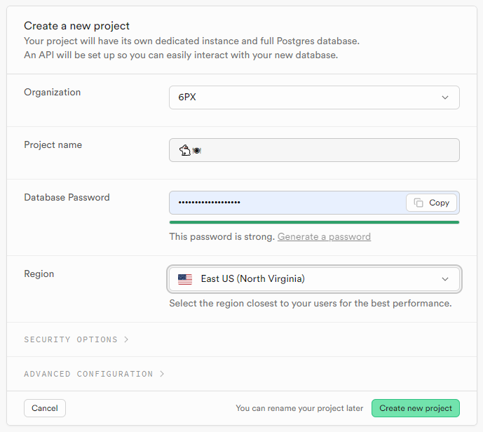
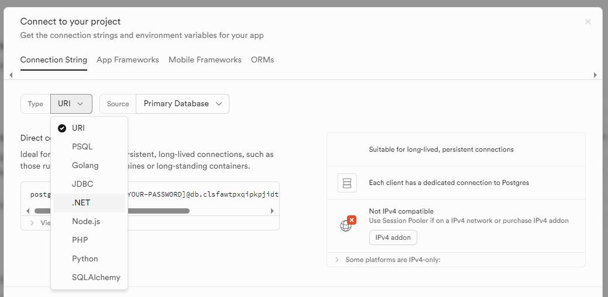
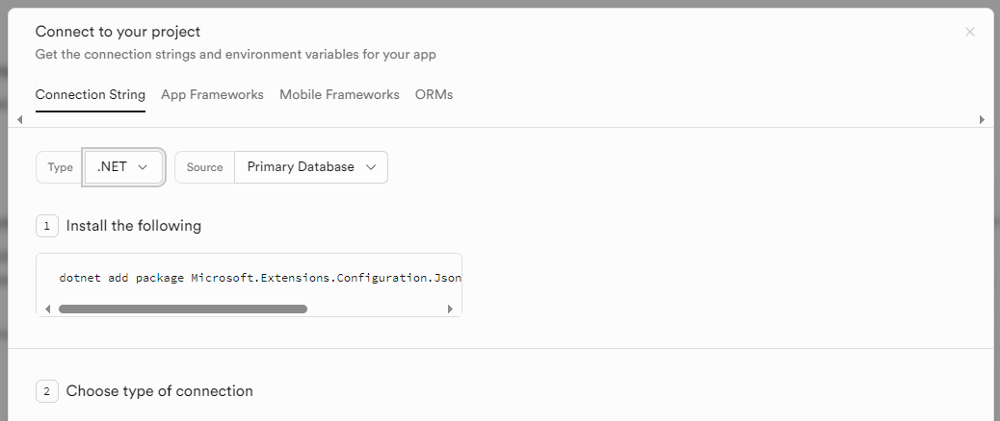
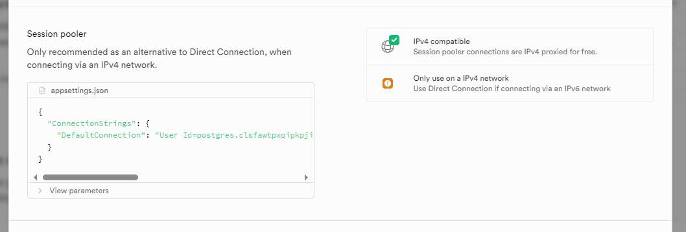
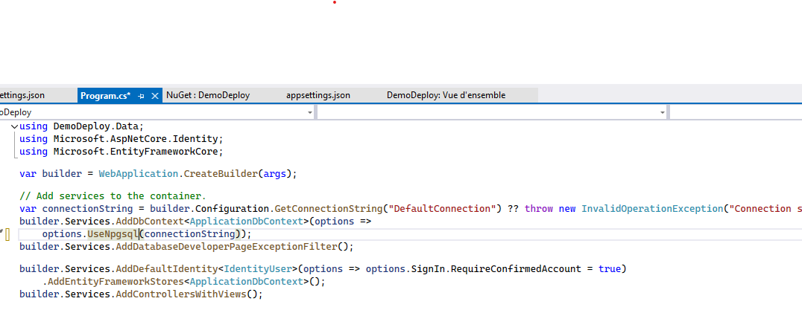
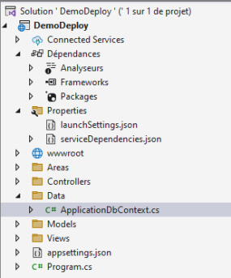
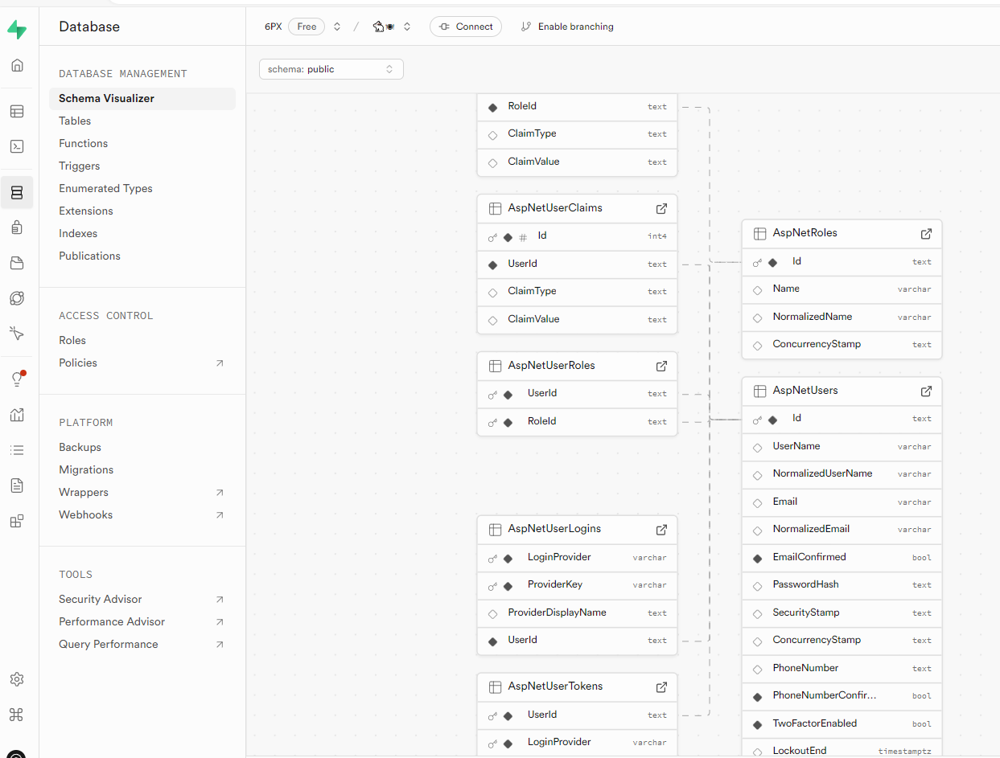
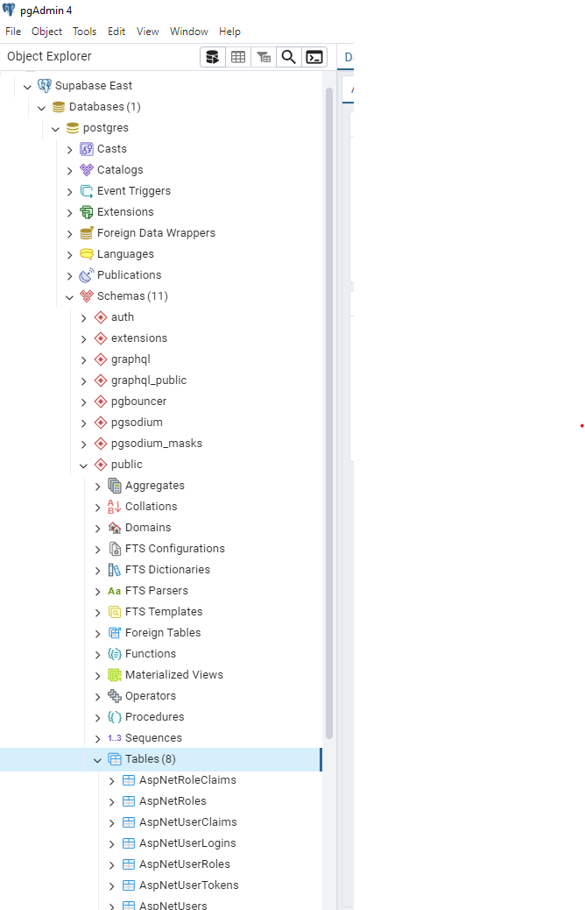

# Utiliser PostgreSQL et Supabase

Pour notre application déployée, nous aurons besoin d'une base de donnée accessible à partir d'Azure, alors la base de données fournite gratuitement par Supabase sera notre choix.

Supabase nous offre une bd postgres 100% gratuite pour chaque projet que vous avez, vous pourrez donc en créer une pour votre application déploiement et une autre pour un environnement de test ou pour utiliser en développement.

## Créer votre projet sur Supabase
- Suivre les captures d'écran
<Row>
  <Column size="8">
    
  </Column>
</Row>
- Choisir un des serveurs suivant
<Row>
  <Column size="8">
    
  </Column>
</Row>

## Ajouter la Connection String
- Cliquer sur Connect
<Row>
  <Column size="8">
    
  </Column>
</Row>
- Choisir .NET pour la Connection String
<Row>
  <Column size="8">
    
  </Column>
</Row>
<Row>
  <Column size="8">
    
  </Column>
</Row>
- Ajouter la Connection String au projet C# et remplacer le mot de passe
<Row>
  <Column size="8">
    
  </Column>
</Row>
<Row>
  <Column size="8">
    
  </Column>
</Row>
- Changer "User Id" pour "Username"
<Row>
  <Column size="8">
    
  </Column>
</Row>

## Configurer Entity Framework
- Installer le package Nuget 
<Row>
  <Column size="8">
    
  </Column>
</Row>
- Configurer le contexte dans Program.cs pour utiliser la librairie de Postgres
<Row>
  <Column size="8">
    
  </Column>
</Row>
- Mettre à jour les migrations (On supprime les migrations actuelles)
<Row>
  <Column size="8">
    
  </Column>
</Row>
- On ajoute une nouvelle migration

```bash
dotnet ef migrations add Init
```

- On mets à jour la base de données

```shell
dotnet ef database update
```

## Voir notre BD
- Vous pouvez voir BD en ligne directement sur Supabase
<Row>
  <Column size="8">
    
  </Column>
</Row>
- Vous pouvez également utiliser pgAdmin qui est l'équivalent pour Postgres de SQL Server Management Studio
<Row>
  <Column size="8">
    
  </Column>
</Row>
- Plus d'informations pour utiliser pgAdmin --> [Connecting with pgAdmin](https://supabase.com/docs/guides/database/pgadmin)