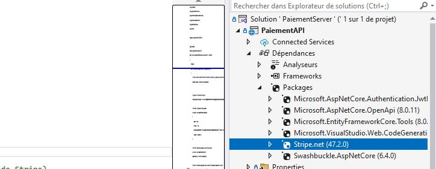
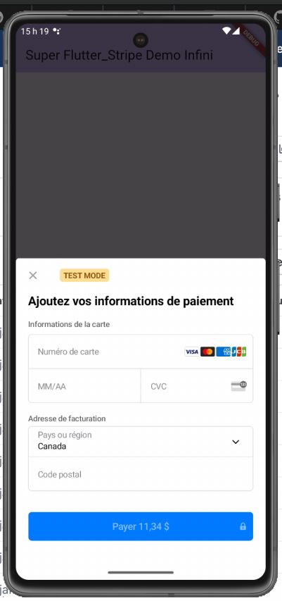
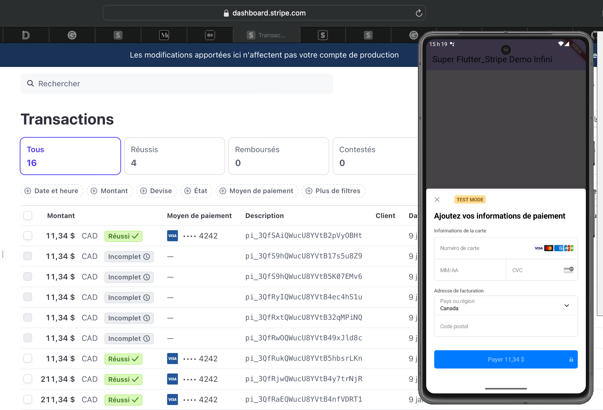

# Paiement avec Stripe


<Row>

<Column>

:::info Capsule

Dans cette capsule, il nous verrons comment créer un module de paiement en utilisant l'API de Stripe.

Nous aurons 3 grandes étapes de réalisation.

**Créer un compte Stripe**

Ici, nous voudrons créer le compte, mais pas au complet pour ne pas avoir à donner un compte bancaire.

Si la création cu compte n'est pas complété, nous pourrons tout utiliser Stripe, mais nous devrons rester en mode test.

**Créer le module de paiement pour le serveur**

Le serveur sera utiliser pour créer l'intention de paiement et un client Stripe au besoin.

L'intention de paiement inclue entre autre les éléement suivent:
- Le montant à payer
- La devise utilisée
- Le client qui sera facturé
- Les moyens de paiement possible

**Créer le module de paiement pour le client**

Au niveau client, nous utiliserons l'intention de paiement créé par le serveur pour pour générer la fenêtre de paiement.

:::

</Column>

</Row>

Mis à jour en janvier 2025

## Exemple de code

Vous pouvez regarder l'exemple de code **[paiement_stripe](https://github.com/departement-info-cem/projet-prog/tree/main/code/paiement_stripe)**.

## Compte Stripe
- Nous allons créer un compte, mais nous ne finaliserons jamais la création du compte, ainsi nous n'aurons pas à entrer un numéro de compte bancaire.

### Créer le compte
<Row>
  <Column size="8">
    
  </Column>
</Row>
<Row>
  <Column size="8">
    
  </Column>
</Row>
<Row>
  <Column size="8">
    
  </Column>
</Row>

### Récupérer les clés publique et privée
- Les clés devrait être directement sur la page d'accueil
<Row>
  <Column size="8">
    
  </Column>
</Row>

### Créer un Sandbox et configurer le compte
- Assurez-vous d'être dans un bac à sable (sandbox), sinon vous pouvez en créer un
<Row>
  <Column size="8">
    
  </Column>
</Row>
- Ajuster les options de paiement
<Row>
  <Column size="8">
    
  </Column>
</Row>
<Row>
  <Column size="8">
    
  </Column>
</Row>
<Row>
  <Column size="8">
    
  </Column>
</Row>
- Activez seulement Cartes, Cartes Bancaires, Apple Pay, Google Pay et désactivez toutes les autres options
<Row>
  <Column size="8">
    
  </Column>
</Row>


## Créer le code Serveur

Sur le serveur, nous pourrons créer l'intention de paiement.

L'intention de paiement sert à préparer un paiement, mais comme qu'un utilisateur pourrait annuler le paiement, on parle d'intention.

### Installer le package Nuget
<Row>
  <Column size="8">
    
  </Column>
</Row>

### Gérer les clients (Facultatif)
Stripe nous permet de gérer les clients, ce qui peut être pratique pour avoir un historique ou encore pour sauvegarder des méthodes de paiement.

Toutefois, ce n'est pas nécessaire pour être capable d'effecturer des paiements.

```js title="Créer un client"
  //TODO Ajouter votre clé d'API secrète
  StripeConfiguration.ApiKey = "sk_test_blablabla_votre_API_KEY_secrete";

  //TODO Créer l'adresse du client
  AddressOptions address = new AddressOptions() 
  {
      City = "Montreal",
      Country = "Canada",
      PostalCode = "J4H 4A9",
      State = "Quebec",
      Line1 = "945 Chambly"
  };

  //TODO Créer un client
  var options = new CustomerCreateOptions
  {
      Email = "jim@nad.com",
      Name = "Jim Nad",
      Address = address
  };

  //TODO Envoyer le client à Stripe
  var service = new CustomerService();
  Customer customer = service.Create(options);
```

### Créer une intention de paiement

```js title="Créer l'intention de paiement"
  // Ajouter la clé secrète de Stripe ici
  StripeConfiguration.ApiKey = "sk_test_blablabla_votre_API_KEY_secrete";

  // On choisi les options de notre paiement
  var options = new PaymentIntentCreateOptions 
  { 
      Amount = 6969, 
      Currency = "cad",
      AutomaticPaymentMethods = new PaymentIntentAutomaticPaymentMethodsOptions() { Enabled = true },
      // Si vous utiliser un client pour faire le paiement
      Customer = customer.Id,
  };

  // On crée l'intention de paiement à partir de nos options
  var service = new PaymentIntentService();
  PaymentIntent pi = service.Create(options);

  // Une fois l'intention de paiement créée, on envoie les informations importantes au client
  PaymentIntentDTO dto = new PaymentIntentDTO();
  dto.ClientSecret = pi.ClientSecret;
  dto.Customer = pi.CustomerId;
```

## Créer le code Mobile

### Installer le package pub.dev
```shell title="Ajouter flutter_stripe"
flutter pud add flutter_stripe
```

### Configurer le projet Android
```js title="Modifier android/settings.gradle"
plugins {
    id "dev.flutter.flutter-plugin-loader" version "1.0.0"
    id "com.android.application" version "8.3.2" apply false
    // TODO - STRIPE - Kotlin doit être à plus de 1.8.0
    id "org.jetbrains.kotlin.android" version "1.8.22" apply false
}
```

```bash title="Modifier android/gradle/wrapper/gradle-wrapper.properties"
# TODO - STRIPE Assurez-vous d'utiliser au moins Gradle 8
distributionUrl=https\://services.gradle.org/distributions/gradle-8.4-all.zip
```

```js title="Ajouter dans android/app/build.gradle"
// TODO - STRIPE - Cela devrait permettre l'utilisation de Google Pay
dependencies {
    implementation 'com.stripe:stripe-android:17.1.1'
}
```

```java title="Modifier MainActivity pour utiliser un fragment"
package org.depinfo.lapin_couvert_mobile

import io.flutter.embedding.android.FlutterActivity
import io.flutter.embedding.android.FlutterFragmentActivity

// TODO - STRIPE - Changer FlutterActivity pour FlutterFragmentActivity
class MainActivity: FlutterFragmentActivity()
```

### Afficher la feuille de paiement
Une fois que vous aurez récupéré les informations de l'intention de paiement provenant sur serveur, vous pourrez générer la feuille de paiement

<Row>
  <Column size="8">
    
  </Column>
</Row>

```java title="On initialise Stripe à l'ouverture de l'application"
void main() async {

  WidgetsFlutterBinding.ensureInitialized();
  
  // Assigner la clé publique (Publishable Key) de Stripe
  Stripe.publishableKey = "pk_test_blablabla_votre_API_KEY_pas_secrete";
  
  // Assigner un identifiant de marchant, ceci est nécessaire pour les paiement iOS entre autre
  Stripe.merchantIdentifier = 'info.cegepmontpetit.ca';
  
  // On applique les configurations
  await Stripe.instance.applySettings();

  runApp(const MyApp());
}
```

```java title="Ouvrir la feuille de paiement"
  // Créer la Feuille de paiement avec les bonnes options
  await Stripe.instance.initPaymentSheet(
    paymentSheetParameters: SetupPaymentSheetParameters(
      // On veut utiliser le processus de paiement par défaut
      customFlow: false,
      merchantDisplayName: 'Super Flutter_Stripe Demo Infini',
      // Le client_secret permet d'identifier l'intention de paiement
      paymentIntentClientSecret: data['client_secret'],
      // On ajoute le ID du client (si nous utilisons un client, ce n'est pas obligatoire)
      customerId: data['customer'],
      // On ajoute Google Pay et Apple Pay
      applePay: const PaymentSheetApplePay(
        merchantCountryCode: 'CA',
      ),
      googlePay: const PaymentSheetGooglePay(
        merchantCountryCode: 'CA',
        testEnv: true,
      ),
    ),
  );
```

## Suivre les paiements
Sur votre Dashboard Stripe, vous pourrez suivre les paiements effectués
<Row>
  <Column size="8">
    
  </Column>
</Row>

## Cartes à utiliser

Vous pouvez regarder les différentes cartes à utiliser **[documentation Stripe](https://docs.stripe.com/testing#cards)**.

## Exemple de code

Vous pouvez regarder l'exemple de code **[paiement_stripe](https://github.com/departement-info-cem/projet-prog/tree/main/code/paiement_stripe)**.
