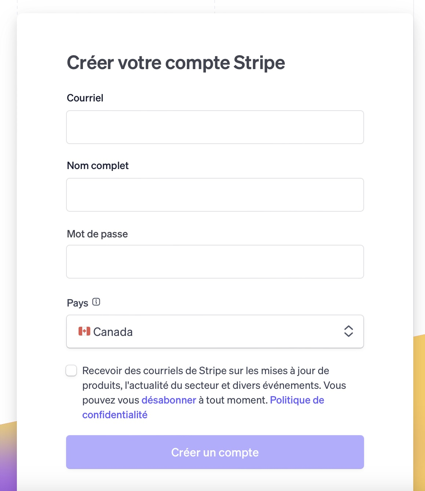
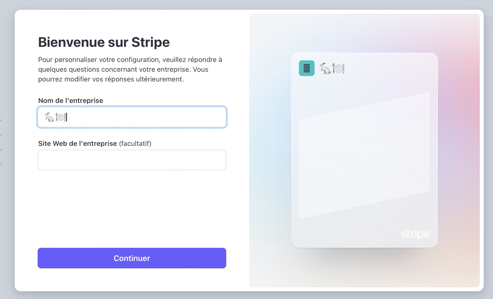
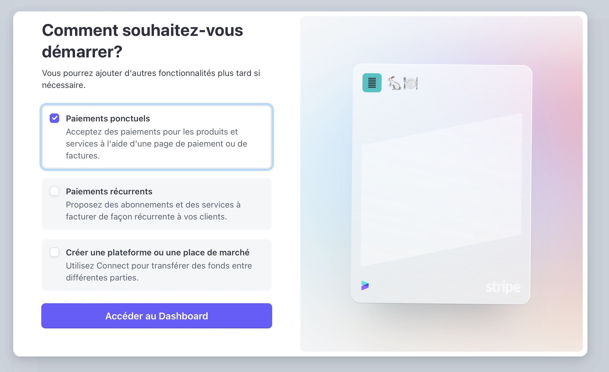
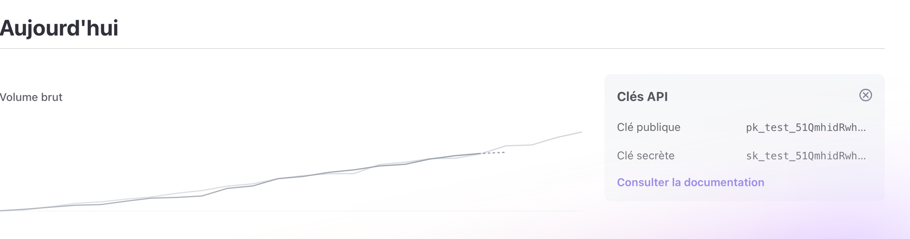
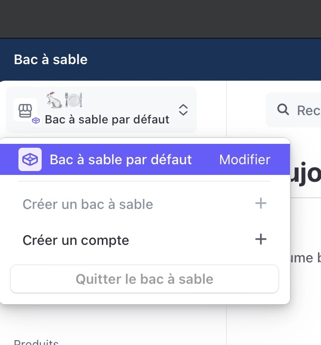
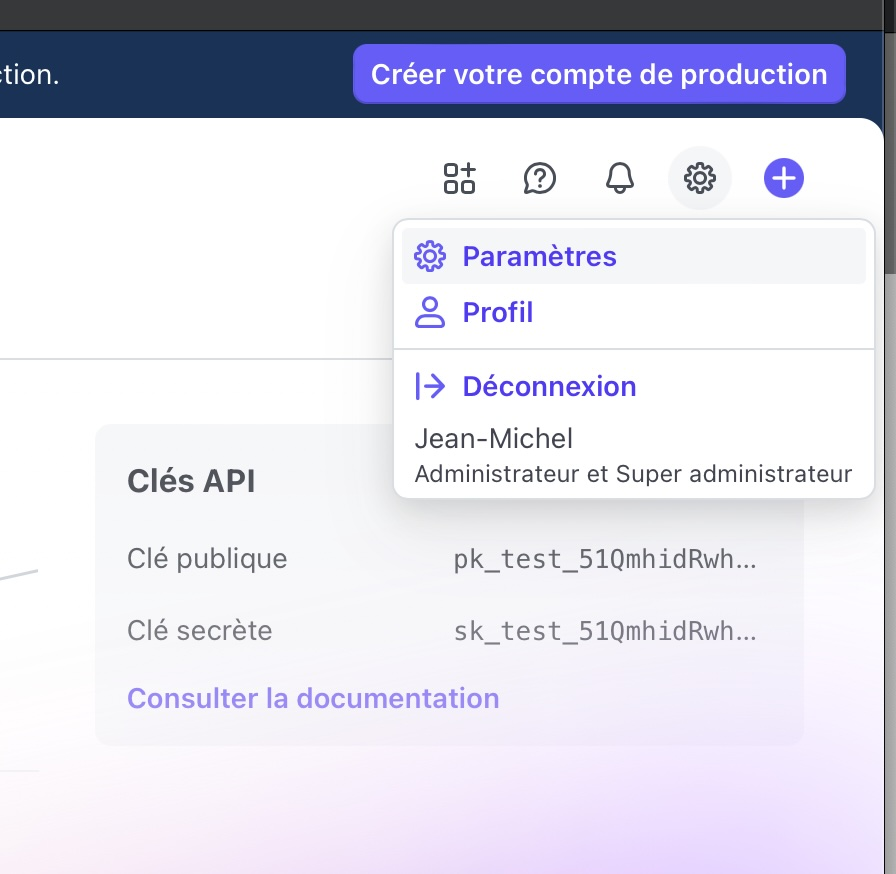
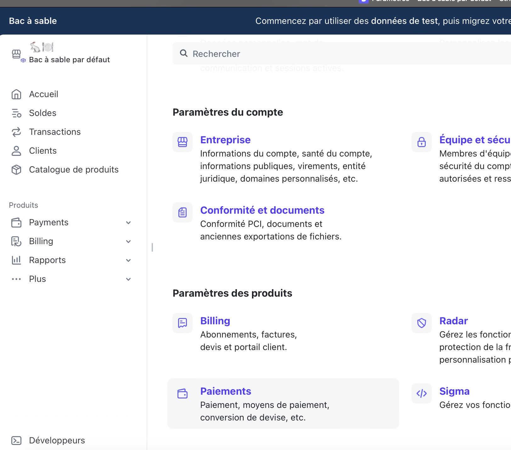
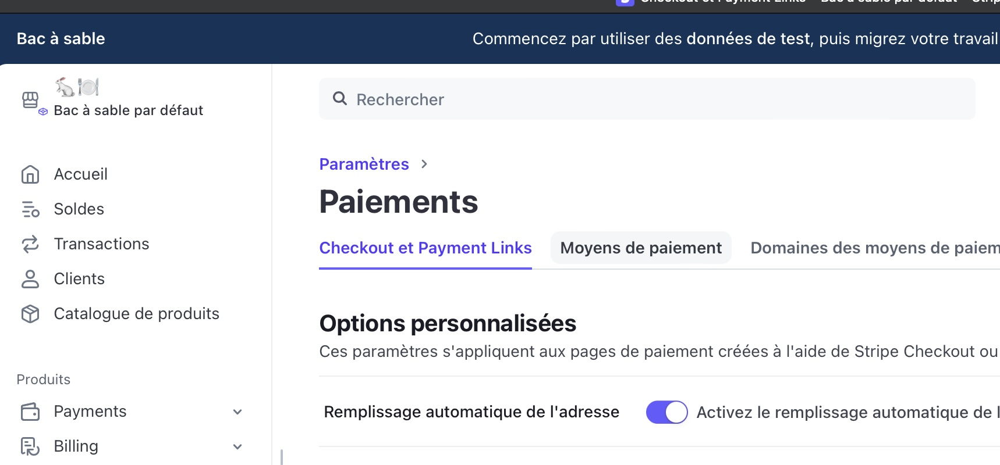
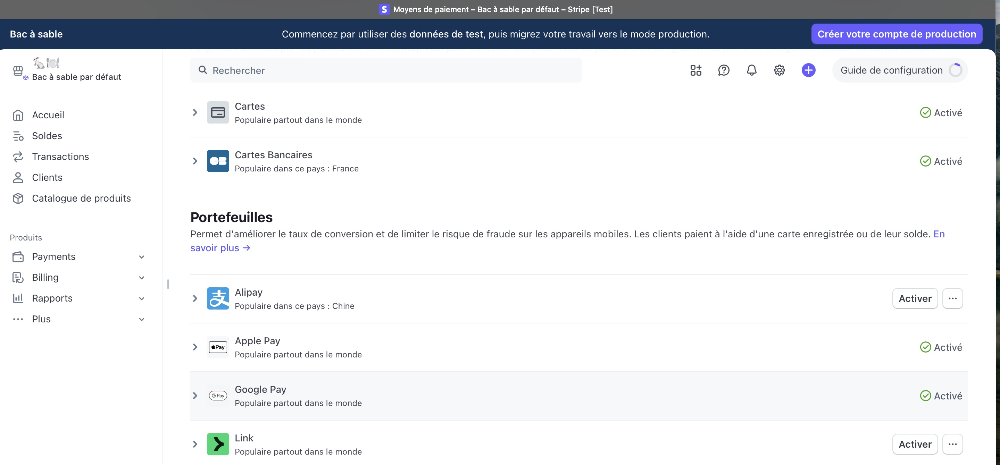
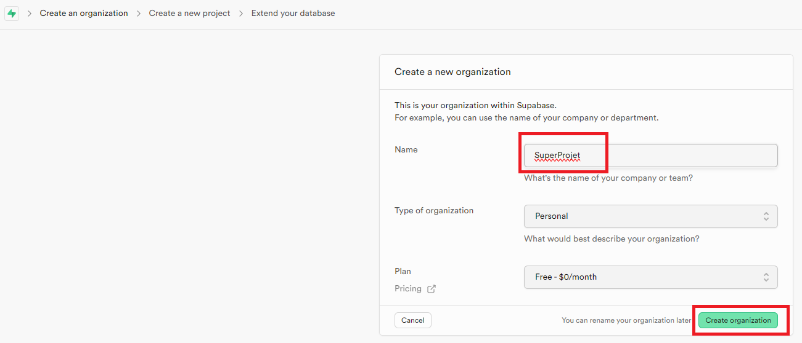

# Paiement avec Stripe


<Row>

<Column>

:::info Capsule

Dans cette capsule, il nous verrons comment créer un module de paiement en utilisant l'API de Stripe.

Nous aurons 3 grandes étapes de réalisation.

**Créer un compte Stripe**

Ici, nous voudrons créer le compte, mais pas au complet pour ne pas avoir à donner un compte bancaire.

Si la création cu compte n'est pas complété, nous pourrons tout utiliser Stripe, mais nous devrons rester en mode test.

**Créer le module de paiement pour le serveur**

Le serveur sera utiliser pour créer l'intention de paiement et un client Stripe au besoin.

L'intention de paiement inclue entre autre les éléement suivent:
- Le montant à payer
- La devise utilisée
- Le client qui sera facturé
- Les moyens de paiement possible

**Créer le module de paiement pour le client**

Au niveau client, nous utiliserons l'intention de paiement créé par le serveur pour pour générer la fenêtre de paiement.

:::

</Column>

</Row>

Mis à jour en janvier 2025

## Exemple de code

Vous pouvez regarder l'exemple de code **[paiement_stripe](https://github.com/departement-info-cem/projet-prog/tree/main/code/paiement)**.

## Compte Stripe
- Nous allons créer un compte, mais nous ne finaliserons jamais la création du compte, ainsi nous n'aurons pas à entrer un numéro de compte bancaire.

### Créer le compte
<Row>
  <Column size="8">
    
  </Column>
</Row>
<Row>
  <Column size="8">
    
  </Column>
</Row>
<Row>
  <Column size="8">
    
  </Column>
</Row>

### Récupérer les clés publique et privée
- Les clés devrait être directement sur la page d'accueil
<Row>
  <Column size="8">
    
  </Column>
</Row>

### Créer un Sandbox et configurer le compte
- Assurez-vous d'être dans un bac à sable (sandbox), sinon vous pouvez en créer un
<Row>
  <Column size="8">
    
  </Column>
</Row>
- Ajuster les options de paiement
<Row>
  <Column size="8">
    
  </Column>
</Row>
<Row>
  <Column size="8">
    
  </Column>
</Row>
<Row>
  <Column size="8">
    
  </Column>
</Row>
- Activez seulement Cartes, Cartes Bancaires, Apple Pay, Google Pay et désactivez toutes les autres options
<Row>
  <Column size="8">
    
  </Column>
</Row>


## Créer le code Serveur

### Installer le package Nuget

### Gérer les clients (Facultatif)

### Créer une intention de paiement


## Créer le code Mobile

### Installer le package pub.dev

### Configurer le projet Android

### Afficher la feuille de paiement

## Ajoute des images

- suivre les captures d'écran

<Row>
  <Column size="8">
    
  </Column>
</Row>

## Ajouter du code

```dart
final supabase = Supabase.instance.client;

//TODO doc: https://supabase.com/docs/reference/dart/storage-from-getpublicurl
string url = supabase
  .storage
  .from('le-nom-de-mon-bucket')
  // TODO le bucket doit être public pour qu'on puisse récupérer l'URL public
  .getPublicUrl("nom-du-fichier");
```

## Exemple de code

Vous pouvez regarder l'exemple de code **[paiement_stripe](https://github.com/departement-info-cem/projet-prog/tree/main/code/paiement)**.