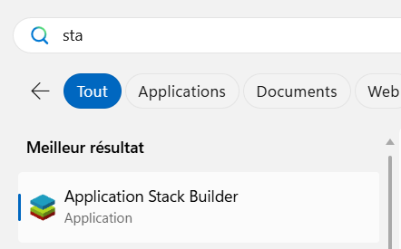
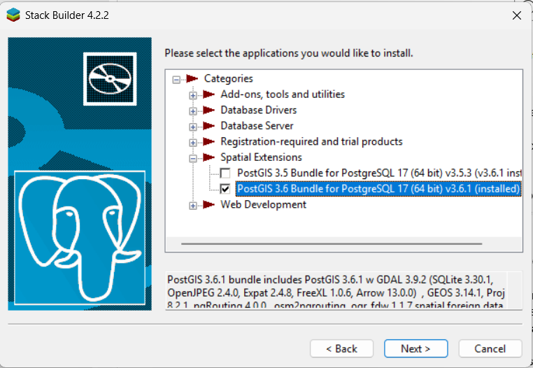
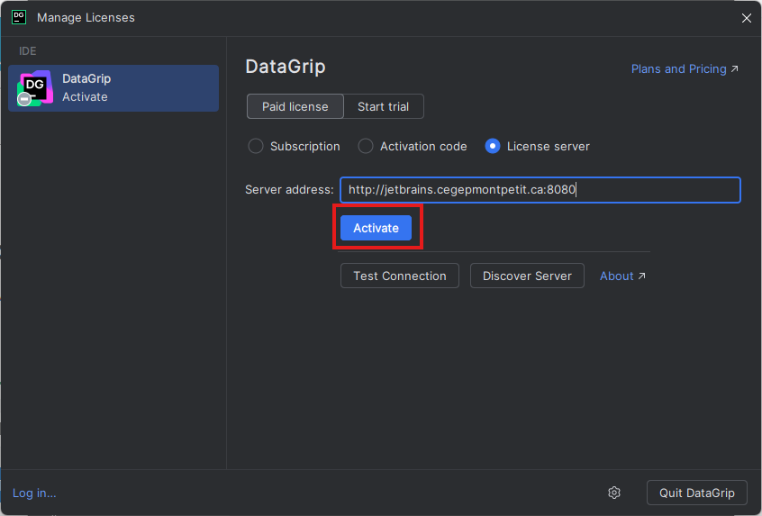
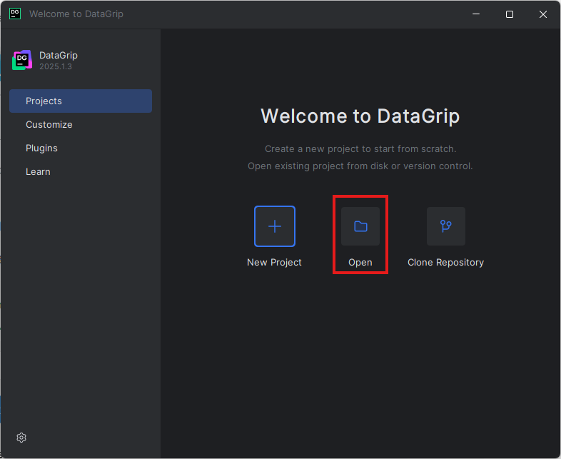
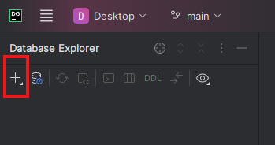
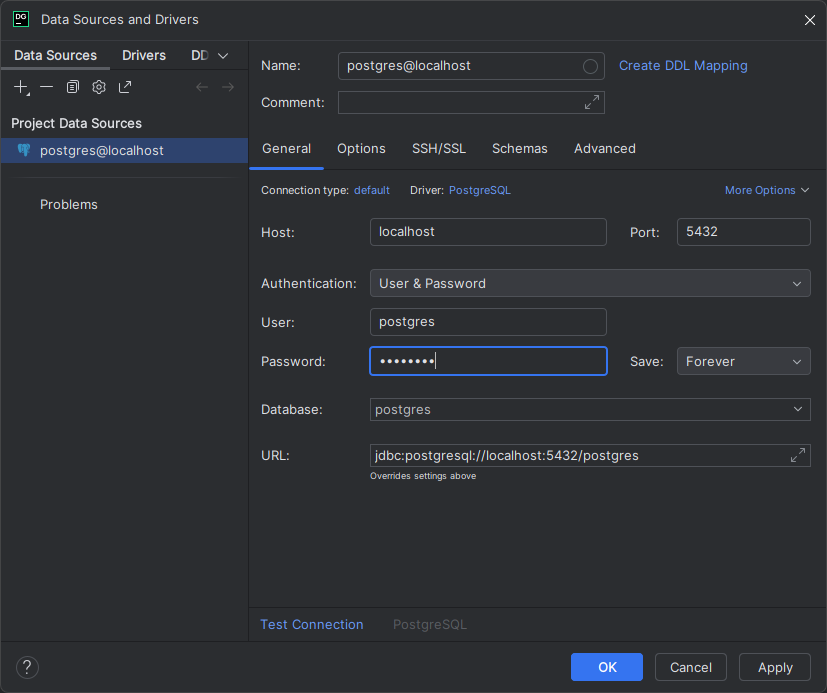
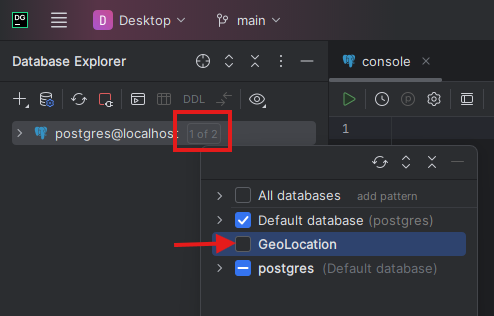

import Tabs from '@theme/Tabs';
import TabItem from '@theme/TabItem';

# Base de données Postgres

Ce n'est pas toujours facile de trouver un hébergement gratuit pour un serveur de BD SQL et pour le projet on a décidé d'utiliser une BD Postgres. En plus, ça vous permet d'apprendre quelque chose! Ça reste du SQL, donc ce que vous avez appris en cours fonctionne toujours, mais chaque technologie à ses propres fonctionnalités, subtilités et ses propres outils.

## Configuration dans VisualStudio

Voici donc comment faire la configuration dans votre projet:

- Ajouter la librairie pour entity avec Postgres
- Tant qu'à jouer dans les librairies, on ajoute tout de suite celle pour le support de la géo localisation

Dans Program.cs, il faut indiquer qu'on utilise Postgres, de la même façon que normalement ont indiquait sql server. On veut donc **remplacer** l'ancien code par celui-ci. Encore une fois, on en profite pour activer le support des données de géo localisation.

Il reste seulement à mettre à jour votre string pour la connexion avec le nom de votre BD.
Le mot de passe est vraiment Passw0rd et le username postgres.

Une fois que c'est fait, add-migration et update-database vont fonctionner de la même façon.

:::warning
Si vous voulez effacer votre BD (ou faire des Select ou autres opérations de BD), vous ne pouvez pas utiliser SQL Server Management Studio ou l'explorateur d'objects SQL Server intégré dans Visual Studio.
:::

:::danger
Si vous changez de technologie de BD (par exemple de MS SQL SERVER vers Postgres) et que vous avez déjà des migrations, il faut les effacer et les refaire toutes! Pourquoi? Ces fichiers contiennent des commandes spécifiques à la technologie de BD qui sont suffisament différentes pour que ça ne soit pas compatible.
:::

## Module PostGIS

Il faut également ajouter un module qui se nomme PostGIS et qui est utilisé, vous l'aurez deviné, pour la géo localisation. Pour faire ça facilement, utilisez cet outil:

Il faut sélectionner votre installation de BD (un seul choix possible) et ensuite:

Après, c'est simplement d'utiliser les options par défaut et de terminer l'installation!

## Gestion de la BD

Pour gérer vos BDs Postgres, il y a plusieurs outils préinstallés sur votre poste :

<Tabs>
<TabItem value="cli" label="Ligne de commande" default>

Voici comment on se connecte à la BD et que l'on efface une BD avec cet outil.

:::warning
Au moment de taper le mot de passe, rien ne s'affiche pendant que vous tapez, mais ça fonctionne quand même!
:::

:::danger
C'est normal de se connecter à la BD **postgres** dans ce cas, on ne **peut pas** effacer la BD sur laquelle on est présentement connecté!
:::

</TabItem>
<TabItem value="dg" label="DataGrip" default>

    <Row>

    <Column>

    Pour activer la license, sélectionner l'option **"License server"**. Le serveur de license du CÉGEP devrait être trouvé automatiquement. Vous pouvez ensuite sélectionner **Activate**.

    

    </Column>

    <Column>

    Sur l'interface principale, vous pouvez sélectionner le dossier de votre projet de code serveur. Honnêtement, n'importe quel dossier peut faire l'affaire.

    

    </Column>

    </Row>

    <Row>

    <Column>

    On peut maintenant ajouter une connexion à un serveur de base de données. Vous pouvez sélectionner Postgres dans la liste.

    

    </Column>
    <Column>

    Les informations de connexion au serveur préinstallé sont nom d'utilisateur : `postgres` et le mot de passe `Passw0rd`.

    
    </Column>
    </Row>

Le serveur ajouté devrait s'afficher dans la liste du Database Explorer. Vous pourrez sélectionner les bases de données qui vous intéressent.

Vous pouvez maintenant faire des requêtes, explorer les tables dans la BD, etc.

</TabItem>
</Tabs>