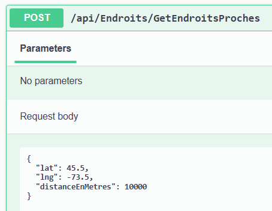

# Coordonnées géographiques

Mis à jour en janvier 2026

## Besoin

On veut sauvegarder des positions dans notre BD. Les coordonnées sur une carte sont généralement stocké en utilisant des valeurs de **latitude** et de **longitude**. Vous pouvez en théorie simplement stocker ces données en utilisant deux valeurs double et le tour est joué!

**Mais** comment allez vous faire une requête pour obtenir tout les endroits qui sont à une certaine distance d'un point en mètres? Calculer la distance entre deux endroits?

Le sujet est vraiment plus complexe qu'on pourrait le croire, entre autres parce que la terre n'est pas vraiment ronde! Pas dans le sens qu'elle est plate, mais plutôt qu'elle n'est pas PARFAITEMENT ronde. Si vous vous souvenez de vos cours de géographie, il y a aussi l'enjeu de la projection d'un coordonnée en 2d vers une sphère en 3d. Pour ceux qui sont curieux: [WebMercator](https://en.wikipedia.org/wiki/Web_Mercator_projection) (Non, l'Antarctique n'est pas AUSSI grand que ça, mais il est quand même presque aussi grand que la Russie )

:::warning
La démo utilise une meilleure projection que WebMercator, qui donne des erreurs assez importantes à notre parallèle (environ 45), mais qui est rapide et est utilisée fréquemment pour les calculs rapides de petites distances.
:::

**Bref**, la démo fournit un exemple qui permet de stocker les coordonnées correctement dans la BD et de faire des requêtes qui calculent les distances, comme dans la méthode **GetEndroitsProches**.

Il y a également la méthode **GetDistanceEntreDeuxEndroits** qui fait un calcul de distance sur le serveur (au lieu de le faire directement avec la BD). C'est un scénario plus complexe et on a fourni la classe **GeometryExtensions** qui permet de faire une projection des points pour ensuite faire le calcul de la distance.

:::warning
Vous avez seulement besoin de **GeometryExtensions** si vous voulez calculer des distances à l'intérieur de votre logique sur le serveur comme dans l'exemple **GetDistanceEntreDeuxEndroits**. Il est tout à fait possible d'écrire cette méthode en faisant le calcul avec la BD, c'est uniquement là comme exemple.
:::

## Exemple de code

Vous pouvez regarder l'exemple de code **[DemoCoordonnesGeo](https://github.com/H26-Projets/DemoCoordonnesGeo)**.

## Exemple d'utilisation

Si vous faites une requête pour obtenir les endroits qui sont près du point latitude: 45.5 et longitude -73.5 et une distance de 10,000 mètres,

Vous devriez avoir ceci comme résultat:

Évidemment, si vous réduisez la distance de la requête à 5,000 mètres, vous n'allez avoir qu'un seul résultat, le Cégep (CEM).

Et si vous augmentez la distance à 120 km, vous allez découvrir un endroit étrange et merveilleux!