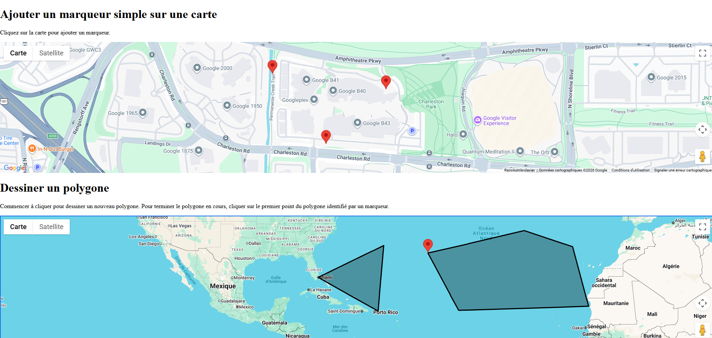

# Interagir avec Google Maps

Mis à jour en février 2026

## Besoin

Ajouter des marqueurs et créer des polygones sur une carte Google Maps.

Un polygone, c'est une figure géométrique plane et fermée, délimitée par une suite de segments de droite (côtés) reliés entre eux, formant des sommets.

## Exemple de code

Fiez vous à l'exemple de code disponible [ici](https://github.com/departement-info-cem/projet-prog/tree/main/code/ngCreateurDePolygones)

Pour le mettre en marche, vous devrez :

1. Installer le package npm disponible [ici](https://www.npmjs.com/package/@angular/google-maps?activeTab=readme)
2. Se référer aux étapes [ici](https://github.com/angular/components/tree/main/src/google-maps#angular-google-maps-component) pour obtenir une clé d'API Google Maps, et faire le lien sur le projet Angular.
3. J'ai retiré ma clé d'API qui est dans index.html. Mettez la votre à cet endroit.

## Documentation

La démonstration est entièrement basée sur la documentation suivante : [Composantes Google Maps pour Angular](https://github.com/angular/components/tree/main/src/google-maps#angular-google-maps-component)
